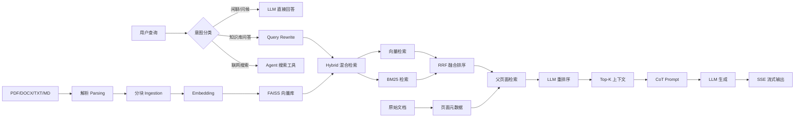
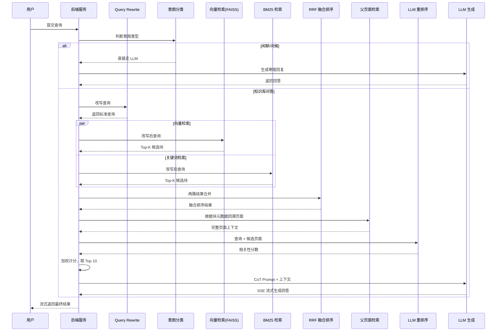

## 一、先跑通一个最小原型

我的 AI 项目里最先跑通的是一条简单 RAG 流水线：

```
PDF/DOCX/TXT/MD → 语义分块 → DashScope Embedding → FAISS 向量检索 → LLM 回答
```

跑是能跑，但一放到真实场景里，立刻暴露了四个短板：

1. **检索精度不够** —— 向量检索只懂"意思相近"，遇到精确术语查询经常跑偏
2. **上下文容易超限** —— 分块太小，召回的上下文支离破碎；分块太大，又会稀释相关性
3. **多文档管理混乱** —— 所有文档塞进一个向量库，主题不同互相污染检索结果
4. **没有精排环节** —— 召回的 Top-K 里混着不少"语义沾边但实际无关"的内容

这篇文章记录的，就是如何从原型升级为生产级系统的全过程。

---

## 二、RAG 系统的全貌

### 整体架构



### 四个核心环节

| 环节 | 作用 |
|------|------|
| **解析（Parsing）** | 把各种格式的文档转成干净文本，保留表格结构 |
| **内容提取（Ingestion）** | 分块、创建并载入知识库 |
| **检索（Retrieval）** | 根据用户查询查找相关数据 |
| **回答（Answering）** | 把检索结果 + 用户提问组成 prompt，提交给 LLM |

**一个核心认知：系统化方法胜于"神奇方案"**

做 RAG 最容易踩的坑，就是迷信某一项"突破性技术"——换个更强的 embedding、换更新的 LLM，指望一招制敌。但真正实现后发现：成功并非依赖单一突破性技术，而是通过系统化的流程优化，结合并精细调整多种技术。

下面逐个展开。

---

## 三、解析（Parsing）：PDF 到文本的硬骨头

把 PDF 转成纯文本，听起来简单，实际充满了无数细微难题：保留表格结构、识别多栏文本、处理图表和公式...

原型里用的 `PyPDF2` 在干净文本型 PDF 上还行，但碰到复杂排版的文档，提取出来的文本基本没法用。

**解析器选型**：我尝试对比了多种解析器，最终选择 **Docling** 处理英文文档，中文场景用 **MinerU**，对中文 PDF 的版面还原效果不错。

**表格用什么格式交给 LLM？**

LLM模型对 HTML 的理解程度远高于 Markdown，HTML 能描述合并单元格、子标题和其他复杂表格结构。所以涉及复杂表格时，让解析器输出 HTML 再喂给 LLM，比 Markdown 更可靠。

### 解析模块示例

```python
import fitz  # PyMuPDF
from docx import Document

async def parse_document(file_path: str, file_type: str) -> list[dict]:
    """统一文档解析入口，返回带页面/段落元数据的文本块"""
    pages = []

    if file_type == "pdf":
        doc = fitz.open(file_path)
        for page_num, page in enumerate(doc, start=1):
            text = page.get_text()
            pages.append({
                "page": page_num,
                "content": text.strip(),
                "source": file_path
            })
    elif file_type == "docx":
        doc = Document(file_path)
        for para_num, para in enumerate(doc.paragraphs, start=1):
            if para.text.strip():
                pages.append({
                    "page": para_num,
                    "content": para.text.strip(),
                    "source": file_path
                })
    else:
        # txt / md
        with open(file_path, "r", encoding="utf-8") as f:
            pages.append({
                "page": 1,
                "content": f.read(),
                "source": file_path
            })

    return pages
```

---

## 四、内容提取（Ingestion）：分块与知识库的组织

### 分块策略

分块不是越大越好。核心权衡是**查询和文本块之间的语义连贯性**：

> 通常情况下，能回答问题的信息片段不超过十个句子。因此，一个包含目标语句的小段落，会比同样语句稀释在一整页相关性较弱的文本中获得更高的相似度得分。

我的项目用的是 **chunk_size=500, overlap=50**，同时兼顾句子边界，保证切分处不会打断语义。参数不是拍脑袋定的，而是在实际测试中发现这个粒度在"信息密度"和"检索精度"之间达到了比较好的平衡。

### 知识库组织：多库隔离

项目里不是只有一个知识库，而是按主题隔离成多个 FAISS 库：

- LangChain 学习笔记库
- FastAPI 项目文档库
- 个人技术博客库

每个库独立建索引，使用 `IndexFlatIP`（向量原样存储，暴力搜索精度更高）：

- **优点**：结构清晰，主题隔离，查询时不互相污染
- **缺点**：计算和内存消耗更高（但在数据量没到百万级之前完全够用）

这也是为什么选 FAISS 而不是 Milvus：个人项目数据量小，FAISS 够轻、够快、够准。亿级数据再上 Milvus。

### 分块 + 建库示例

```python
from langchain.text_splitter import RecursiveCharacterTextSplitter
from langchain_community.vectorstores import FAISS
from langchain_community.embeddings import DashScopeEmbeddings

def build_knowledge_base(pages: list[dict], kb_name: str):
    """把文档页面切分成 chunk，并建立 FAISS 索引"""
    splitter = RecursiveCharacterTextSplitter(
        chunk_size=500,
        chunk_overlap=50,
        separators=["\n\n", "\n", "。", "；", " ", ""]
    )

    documents = []
    for page in pages:
        chunks = splitter.split_text(page["content"])
        for idx, chunk in enumerate(chunks):
            documents.append(Document(
                page_content=chunk,
                metadata={
                    "page": page["page"],
                    "chunk_index": idx,
                    "source": page["source"]
                }
            ))

    embedding = DashScopeEmbeddings(model="text-embedding-v3")
    vector_store = FAISS.from_documents(
        documents,
        embedding,
        normalize_L2=True
    )
    vector_store.save_local(f"faiss_index/{kb_name}")
    return vector_store
```

---

## 五、检索（Retrieval）：上混合搜索

**"垃圾进，垃圾出"（Garbage in → Garbage out）**——如果检索阶段没召回必要信息，LLM 无论如何也答不对。

单一向量检索的问题是：它只懂"意思相近"，不懂"精确匹配"。比如查"LangGraph 中 `update_state` 的用法"时，向量检索可能召回"LangGraph 入门介绍"，因为语义上"沾边"，但实际内容完全不相关。

### 解法：Hybrid 混合检索

生产环境的标准做法是**向量语义检索 + BM25 关键词检索**双路召回：

| 检索方式 | 擅长 | 短板 |
|---|---|---|
| 向量检索 | 语义相关、同义词、改写查询 | 精确术语召回弱 |
| BM25 | 关键词精确匹配、高频词加权 | 无法理解语义改写 |

两者互补，把召回率拉上去，同时让 Top-K 结果里既有语义相关的、也有精确命中的。

### RRF 融合排序

向量检索和 BM25 的打分尺度完全不同，不能直接加权融合。我的方案是用 **RRF（Reciprocal Rank Fusion）**：只依赖排名位次，不依赖分数绝对值，天然规避了尺度差异问题。

```python
from langchain_community.retrievers import BM25Retriever
from langchain.retrievers import EnsembleRetriever

def create_hybrid_retriever(documents, vector_store, k=10):
    vector_retriever = vector_store.as_retriever(search_kwargs={"k": k})
    bm25_retriever = BM25Retriever.from_documents(documents, k=k)
    ensemble = EnsembleRetriever(
        retrievers=[vector_retriever, bm25_retriever],
        weights=[0.5, 0.5]
    )
    return ensemble
```

> 注意：`BM25Retriever` 的输入需要是 LangChain 的 `Document` 对象列表，所以 `documents` 参数从建库阶段直接传入即可。

### 前置过滤：Query Rewrite + 意图分类

检索之前加了两道前置处理：

**Query Rewrite**：把口语化查询改写成标准形式。比如"LangGraph 里怎么更新状态" → "LangGraph update_state API 用法"。

**意图分类**：判断查询类型——知识库问答走 Hybrid 检索，闲聊直接让 LLM 回答，需要联网搜索切到 Agent 工具。避免把无关查询硬塞进知识库检索。

### Query Rewrite + 意图分类示例

```python
from langchain_core.messages import SystemMessage, HumanMessage
from langchain_openai import ChatOpenAI

INTENT_PROMPT = """你是一个查询意图分类专家。请判断用户输入属于以下哪一类：
1. chitchat - 闲聊、问候
2. knowledge - 需要查询知识库
3. search - 需要联网搜索最新信息

只返回类别标签，不要解释。"""

REWRITE_PROMPT = """你是一名查询改写专家。请把用户的口语化问题改写为适合搜索引擎检索的标准形式，
保留关键术语、API 名称、专有名词。只返回改写后的查询。"""

async def preprocess_query(query: str) -> dict:
    llm = ChatOpenAI(model="qwen-turbo")

    # 意图分类
    intent_msg = [
        SystemMessage(content=INTENT_PROMPT),
        HumanMessage(content=query)
    ]
    intent = (await llm.ainvoke(intent_msg)).content.strip().lower()

    if intent == "chitchat":
        return {"intent": "chitchat", "query": query}

    # 查询改写
    rewrite_msg = [
        SystemMessage(content=REWRITE_PROMPT),
        HumanMessage(content=query)
    ]
    rewritten = (await llm.ainvoke(rewrite_msg)).content.strip()

    return {"intent": intent, "query": rewritten}
```

---

## 六、重排序（Reranking）：两段式精排

召回之后还有一道精排关卡。原型里完全没有这一环，所以 Top-K 里常常混进"语义沾边但实际无关"的结果。

### 手段一：专用重排模型（jina-reranker）

jina-reranker 采用**交叉编码器**架构，对查询和文档**联合编码**，能捕捉 token 级别的交互细节。相比双塔 embedding（分别编码再算距离），交叉编码器更准但更慢，所以只放在召回后做精排，不做全库召回。

### 手段二：LLM 重排序

直接通过 Prompt 给 LLM 设定角色，让它对每个候选块打相关性分数（0-1，步长 0.1）。关键约束是"只基于内容客观评价，不做假设"——从源头堵住幻觉。

```
你是一个 RAG 检索重排序专家。
你将收到一个查询和一个检索到的文本块，请根据其与查询的相关性进行评分。

评分说明：
1. 推理：分析文本块与查询的关系
2. 相关性分数（0-1，步长 0.1）
3. 只基于内容客观评价，不做假设
```

### 父页面检索（Parent Page Retrieval）

小块检索精度高，但上下文不够。我的方案是**"小块当指针，大页面做上下文"**：

1. 先检索出 Top N 个最相关的**文本块**
2. 通过块的元数据定位对应的**完整页面**
3. 把整个页面内容纳入上下文

这样把"小块的检索精度"和"大页面的上下文完整度"两者都拿到了。

### jina-reranker 示例

```python
from langchain.retrievers.document_compressors import CrossEncoderReranker
from langchain_community.cross_encoders import HuggingFaceCrossEncoder

def create_reranker_retriever(base_retriever, top_n=5):
    """在 base_retriever 召回后，用 jina-reranker 做精排"""
    model = HuggingFaceCrossEncoder(model_name="jinaai/jina-reranker-v2-base-multilingual")
    reranker = CrossEncoderReranker(model=model, top_n=top_n)

    # 把精排器包装成检索器
    from langchain.retrievers import ContextualCompressionRetriever
    compression = ContextualCompressionRetriever(
        base_compressor=reranker,
        base_retriever=base_retriever
    )
    return compression
```

### 父页面检索 + LLM 重排序示例

```python
async def retrieve_parent_pages(
    query: str,
    ensemble_retriever,
    page_map: dict,          # page_num -> full_page_content
    llm,
    top_k_blocks: int = 30,
    top_k_pages: int = 10
) -> str:
    """六步流水线中的检索到上下文阶段"""

    # 1-2. 初步召回：Hybrid 检索
    blocks = await ensemble_retriever.ainvoke(query)
    blocks = blocks[:top_k_blocks]

    # 3. 父页面提取（去重）
    seen_pages = set()
    candidate_pages = []
    for block in blocks:
        page_num = block.metadata["page"]
        if page_num not in seen_pages:
            seen_pages.add(page_num)
            candidate_pages.append({
                "page": page_num,
                "content": page_map[page_num]
            })

    # 4. LLM 重排序
    rerank_prompt = """你是一个 RAG 检索重排序专家。请评估每个候选页面与查询的相关性，
按 0-1 打分（步长 0.1），只基于内容客观评价，不做假设。

查询：{query}

候选页面：
{pages}

请返回 JSON 数组：[{{"page": 1, "score": 0.9, "reason": "..."}}, ...]"""

    pages_text = "\n\n".join(
        f"[Page {p['page']}]\n{p['content'][:1500]}" for p in candidate_pages
    )
    msg = HumanMessage(content=rerank_prompt.format(
        query=query, pages=pages_text
    ))
    response = await llm.ainvoke([msg])
    scores = json.loads(response.content)

    # 5. 加权计分，取 Top
    for page, score_item in zip(candidate_pages, scores):
        page["score"] = score_item["score"]

    top_pages = sorted(
        candidate_pages,
        key=lambda x: x["score"],
        reverse=True
    )[:top_k_pages]

    # 6. 合并成带页码的上下文字符串
    context = "\n\n".join(
        f"【第 {p['page']} 页】\n{p['content']}" for p in top_pages
    )
    return context
```

---

## 七、整合检索器：六步流水线

把以上环节串起来，就是完整的检索流水线：

1. **查询向量化**
2. **初步召回**：向量检索 + BM25 混合搜索，取 Top 30 候选块
3. **父页面提取**：通过块元数据回溯完整页面（去重）
4. **LLM 重排序**：对页面打相关性分数
5. **加权计分**：调整最终得分
6. **返回 Top 10**：合并成一个带页码的上下文字符串

体现了"召回从宽、精排从严"的经典信息检索思路。

### 检索流程时序图



---

## 八、增强（Augmentation）：提示词工程与思维链

### 提示词集中管理

把所有提示词收进 `prompt.py`，按逻辑切成几块：

- **核心系统指令** — LLM 的角色和行为规则
- **Pydantic schema** — 定义输出格式
- **Few-shot 示例** — 标准答案长什么样
- **模板** — 插入上下文和查询

```python
from pydantic import BaseModel, Field
from typing import List, Union, Literal

def build_system_prompt(instruction: str, example: str, pydantic_schema: str) -> str:
    """三段式拼接：指令 + Schema + 示例"""
    delimiter = "\n\n---\n\n"

    schema_block = (
        f"你的回答必须是 JSON，并严格遵循如下 Schema，字段顺序需保持一致：\n"
        f"```\n{pydantic_schema}\n```"
    )

    parts = [instruction.strip(), schema_block]
    if example:
        parts.append(example.strip())

    return delimiter.join(parts)
```

### 用 Pydantic 约束输出格式

让 LLM 输出结构化 JSON，比自由文本可控得多：

```python
class AnswerSchema(BaseModel):
    step_by_step_analysis: str = Field(
        description="详细分步推理过程，至少 5 步，150 字以上。"
                    "特别注意问题措辞，避免被相似信息迷惑。"
    )
    reasoning_summary: str = Field(
        description="简要总结分步推理过程，约 50 字"
    )
    relevant_pages: List[int] = Field(
        description="仅包含直接用于回答问题的信息页面编号。"
                    "不要包含仅与答案弱相关或间接相关的页面。"
    )
    final_answer: Union[str, Literal["N/A"]] = Field(
        description="如上下文无相关信息，返回 'N/A'，不得编造"
    )
```

**反幻觉设计**：
- `step_by_step_analysis` 强制展开推理，逼模型先思考再回答
- `relevant_pages` 只包含直接相关页面，防止沾边的全塞进来
- `final_answer` 允许返回 `N/A` —— **找不到就承认，绝不编**

### 完整的回答入口示例

```python
from langchain_core.messages import SystemMessage, HumanMessage

async def answer_question(query: str, context: str, llm) -> AnswerSchema:
    instruction = """你是一名严谨的知识库问答助手。请基于提供的上下文回答问题。

规则：
1. 只回答上下文里明确提到的内容
2. 如果上下文没有足够信息，final_answer 返回 'N/A'
3. 涉及 API 名称和参数时，必须与上下文完全一致
4. 先进行分步推理，再给出最终答案"""

    schema = AnswerSchema.schema_json(indent=2)

    example = """示例：
问题：LangGraph 中 update_state 的用法是什么？
答案：
{
  "step_by_step_analysis": "1. 问题询问 LangGraph 中 update_state 的用法。2. 上下文中说明 update_state 用于手动更新图的状态。3. 参数包括 state（当前状态）、values（要更新的值）、as_node（可选，指定以哪个节点身份写入）。4. 示例代码展示在节点外部调用 update_state。5. 因此 update_state 可以手动更新状态并触发后续边。",
  "reasoning_summary": "上下文明确说明 update_state 用于手动更新图状态，包含参数和示例",
  "relevant_pages": [12],
  "final_answer": "update_state(state, values, as_node=None) 用于手动更新 LangGraph 图的状态，其中 values 为要合并到状态的值。"
}"""

    system_prompt = build_system_prompt(instruction, example, schema)

    user_prompt = f"上下文：\n{context}\n\n问题：{query}"

    messages = [
        SystemMessage(content=system_prompt),
        HumanMessage(content=user_prompt)
    ]

    response = await llm.ainvoke(messages)
    return AnswerSchema.parse_raw(response.content)
```

### 思维链（CoT）：让模型先"出声思考"

schema 里的 `step_by_step_analysis` 字段就是 CoT 的体现。最有价值的是处理**看似有答案、其实没有**的模糊上下文。

比如用户问某个 API 的用法，但知识库里只有这个 API 的介绍，没有具体用法。CoT 会引导模型一步步核对：上下文里有哪些信息？这些信息能直接回答问题吗？如果不能，果断返回 N/A。而不是硬猜一个答案。

---

## 九、技术选型总览

| 环节 | 选择 | 理由 |
|------|------|------|
| 文档解析 | PyPDF2 / python-docx / 原生文本（复杂场景用 Docling/MinerU） | 轻量够用，复杂 PDF 用专业解析器 |
| 分块策略 | chunk_size=500, overlap=50, 句子边界 | 兼顾信息密度和语义完整性 |
| Embedding | DashScope text-embedding-v3 | 中文语义效果好 |
| 向量库 | FAISS 多库隔离，IndexFlatIP | 轻量、精度优先 |
| 召回检索 | 向量语义检索 + BM25 混合搜索 | 语义 + 精确互补 |
| 融合排序 | RRF | 不依赖分数绝对值 |
| 精排 | jina-reranker 交叉编码器 + LLM 重排序 | 细粒度语义 + 可解释打分 |
| 上下文 | 父页面检索 | 小块精度 + 大页面完整度 |
| 前置处理 | Query Rewrite + 意图分类 | 提升查询质量 |
| 输出 | SSE 流式响应 + Pydantic schema | 用户体验 + 输出可控 |
| 推理方式 | 思维链 CoT | 抑制幻觉 |

---

## 十、实测对比：纯向量 vs Hybrid

**查询**："LangGraph 中 `update_state` 的用法是什么"

| 检索方式 | Top-1 结果 | 问题 |
|---|---|---|
| 纯向量检索 | "LangGraph 入门介绍" | 语义沾边，但没讲 `update_state` 具体用法 |
| Hybrid 检索 | 包含 `update_state(state, values, as_node=...)` 示例的 chunk | BM25 精确命中 API 名称 |

| Hybrid 检索步骤 | 关键动作 |
|---|---|
| Query Rewrite | 把口语化查询改为 "LangGraph update_state API 用法" |
| 向量召回 | 召回语义相关的 LangGraph 状态管理相关 chunk |
| BM25 召回 | 精确命中包含 `update_state` 关键词的 chunk |
| RRF 融合 | 两路都靠前的 chunk 被排到 Top-1 |
| 父页面检索 | 用 chunk 元数据定位完整页面，获得完整 API 说明和示例 |
| LLM 回答 | 基于上下文准确回答 `update_state` 的参数和作用 |

---

## 总结

从原型到可用，最大的感受是：**RAG 是一项系统工程，而不是一个模型问题。**

原型解决"跑通"，生产级解决"准"。两者的差距藏在那些"不性感"的环节里：解析质量、分块粒度、混合检索、精排重排、提示词工程、思维链。每一项单独拎出来都不复杂，但组合在一起、精细调参后，整体准确率才能质变。

对照原型的四个短板，升级路径如下：

- ✅ **检索精度** → 混合搜索 + 两段式重排序
- ✅ **上下文长度** → 父页面检索
- ✅ **多文档管理** → FAISS 多库隔离 + 智能路由
- ✅ **精排环节** → jina-reranker + LLM 重排序

我的建议是：**先把最小原型跑通，再逐个环节上优化**。另外把"反幻觉"设计贯穿到每一层——强制 CoT、允许 N/A、只基于内容评价。这是 toy demo 和生产级系统之间最关键的分水岭。
